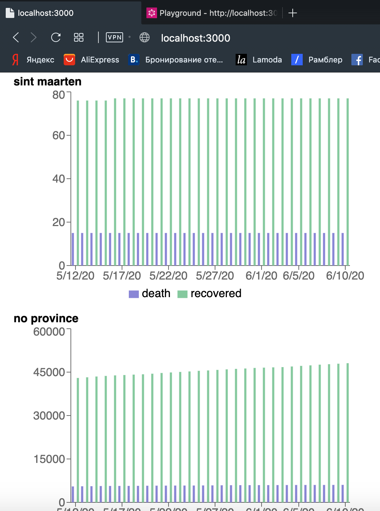

## Chapter 4: Project - COVID app

> [Backend, Frontend]  
> Continue from branch `master`

In this chapter we're going to use what we learned so far to build a covid app.

We're going to implement a GraphQL API using the Novel COVID open API at https://disease.sh/docs/#/JHUCSSE/get_v2_historical

We're going to use the endpoint: `https://disease.sh/v2/historical?lastdays=10`

### Assignment 4.1: Figure out what this endpoint provides

First we look in the swagger at Responses where you can find the schema/model it provides:

```json
{
    "country": "string",
    "province": "string"
}
```

Then we call the service by clicking **"Try it out"**. Huh, but wait, there's more data coming back than defined in the schema?

This actually happens a lot with services when they don't get attention for their output annotations. So this prevents us from using their generated swagger output and autogenerate the types and our client automatically. Without these generated, and versioned types its more difficult to normalize and see changes.

With some trial and error we can still figure out what the real interface is. Use that information and build a schema out of it. Ofcourse keeping in mind which fields are marked as optional fields and which as required (always look at the definition). It would be much easier if it came directly from the service, agree? Well, thats life.

For this next part, make sure you have the application running.

The schema is important to think about, since you will find out you can't take it as is (graphql doesnt have dynamic keys/fields).

Create a schema based on the swagger definition. Then place this schema in `./pages/graphql/schema.ts`. Expose it via the query name `covidHistorical` under the Query part.

### Assignment 4.2: Now expose the data in the form you schematised

Almost there, now we have to fetch the actual data and resolve this. Add the 'covidHistorical' resolver in `./pages/graphql/resolver.ts` and fetch the async data and now normalise this data so it matches your schema!

```js
const response = await fetch('https://disease.sh/v2/historical?lastdays=10');
```

Its time to code, and at same time maybe look at http://localhost:3007/api/graphql to debug on the fly. Its also possible to run the app in debug mode, stop current one and then run `yarn dev:inspect`.

After you exposed the data, you will find out that not every field is how you expected it to be. Also it happens that after exposing the data the schema you defined may not be so smart (for example repetition of data). So its common you adjust in this phase. It also happens when exposing more then one consumer. Think more, less problems on the long run.

When you are done, run `yarn schema:linter`

### 4.3 Bonus assignments

1. We exposed historical data of ten last days, make the days configurable from the query
2. We exposed all historical data, now make it optional to filter for a specific country.
3. We created an endpoint now display the information, frontend is easy when the data is typed :)

The end result can be something like:



## Chapter 4 - Solution: Project - COVID app

### Assignment Solutions

For the assignment solutions see branch `chapter-4-solution`

### Bonus Assignment Solutions

For the bonus assignment solutions see branches

-   `chapter-4-bonus-1`
-   `chapter-4-bonus-2`
-   `chapter-4-bonus-3`
