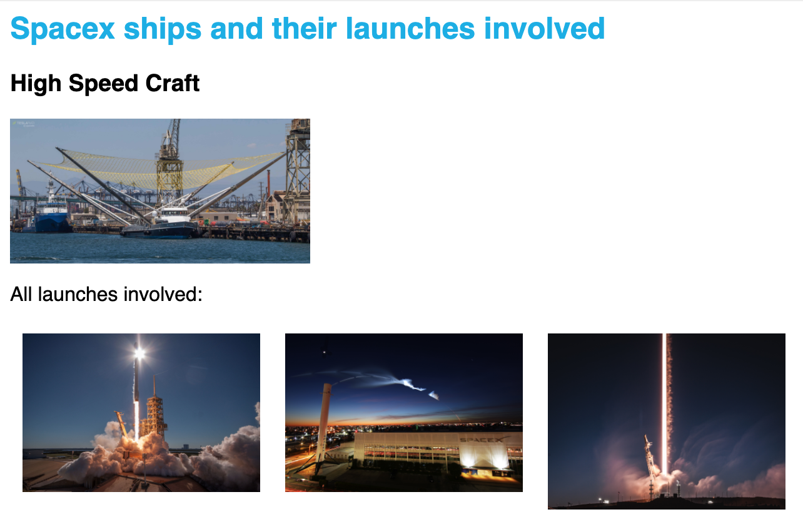

## Final Project: Spacex App

> Backend | Frontend
> Continue from branch `master`

For this exercise we are going to look at the api of `https://api.spacexdata.com/v4/launches/latest` You will start from 'master' branch.

### Assignment 1: Expose its ships

In this endpoint you will find the following data:

```
"ships": [
    "5ea6ed2e080df4000697c908",
    "5ea6ed2e080df4000697c907",
    "5ea6ed2f080df4000697c90b"
],
```

Create the graphql query 'spacexShips' which returns these ship id's. Nothing more. Make sure you can query:

```
{
  spacexShips {
    id
  }
}
```

### Assignment 2: Expose ship information

We returned the ship identification number. On the endpoint: `https://api.spacexdata.com/v4/ships/ID` you will find ship information, so an example is: `https://api.spacexdata.com/v4/ships/5ea6ed2e080df4000697c908`.

Now add a field 'info' to this SpacexShip and resolve with the above endpoint. Expose: 'type', 'image' and 'launches'. For the last ones only its id. Keep it simple. No need to use dataloader yet.

### Assignment 3: Introduce dataloader for ship information

We saw we did request the ship information three times. This is not optimal. We dont have the batched endpoint available yet, but we can start optimizing our endpoint so it will execute the service call only once. Sometimes our services are not optimized for batches but we can start poor mens batching on our side.

Add a dataloader on the context (see for context `./pages/api/graphql/index`). And consume it on the info endpoint. You will need a Promise.all and as learned from our workshop dataloader passes a collection of id's and returns the responses in the same order.

### Assignment 4: Introduce dataloader and add launch information to a launch

We have learned how to extend and resolve on field level with having a dataloader in place. We start now doing the same for launch information.

The endpoint is: `https://api.spacexdata.com/v4/launches/ID` and example is `https://api.spacexdata.com/v4/launches/5eb87d0dffd86e000604b35b`.

Only expose the images collection. You will find it in:

```
"links": {
    ...
    "flickr": {
        "small": [],
        "original": [
            "https://farm5.staticflickr.com/4477/38056454431_a5f40f9fd7_o.jpg",
            "https://farm5.staticflickr.com/4455/26280153979_b8016a829f_o.jpg",
            "https://farm5.staticflickr.com/4459/38056455051_79ef2b949a_o.jpg",
            "https://farm5.staticflickr.com/4466/26280153539_ecbc2b3fa9_o.jpg",
            "https://farm5.staticflickr.com/4482/26280154209_bf08d76361_o.jpg",
            "https://farm5.staticflickr.com/4493/38056455211_a4565a9cee_o.jpg"
        ]
    ]
},
```

Make sure we are able to execute the following query:

```
{
  spacexShips {
    id
    info {
      type
      image
      launches {
        id
        images
      }
    }
  }
}
```

### Assignment 5: Add cacheControl in the service

We see that we request lots of services, but we can cache from using the CacheControl directive. Lets cache all for 5 minutes shall we?

Turn on cacheControl on `./pages/api/graphql/index`.

```
    cacheControl: true,
    plugins: [responseCachePlugin()],
```

Now:

-   Add cacheControl directive to schema
-   Add cacheControl directive to the schema types

Restart the server if you added all. If you did it correctly you will see no cache hint in playground and you will see no real service calls.

So good, when playground extension is like:

```
"extensions": {
    "cacheControl": {
      "version": 1,
      "hints": []
    }
  }
```

### Assignment 6: Expose the data in an app (FRONTEND)

When you followed the previous steps (or checkout mpth-spacex-5 when you didnt want to do the server part) you are able to do the following query:

```
{
  spacexShips {
    id
    info {
      type
      image
      launches {
        id
        images
      }
    }
  }
}
```

Make a new component and expose it on the first page.



### Assignment 7: Reuse dataloader for retrieving sinlge ship

Now add a single ship query and show us how you would do it. Its simple if you have the dataloader setup in place. Dont think too hard.

Make sure you can do the following query as the end of your coding results

```
{
  spacexShip(id:"5ea6ed2e080df4000697c908") {
    id
    info {
      type
    }
  }
}
```

So add the query 'spacexShip' to your schema and show us how to resolve.

### Bonus

-   show the images in the frontend
-   make endpoint for specific launch and re-use the dataloader. You will see you dont have to code anything simply use the dataloader
-   make two frontend components with a different launch ID and see how it works in the frontend (batched query)
-   do basically anything you want, you have the api, you own the data :)

## Final Project - Solution: Spacex App

The solutions for the project can be found under the branches

-   `spacex-solution-1`
-   `spacex-solution-2`
-   `spacex-solution-3`
-   `spacex-solution-4`
-   `spacex-solution-5`
-   `spacex-solution-6`
-   `spacex-solution-7`
