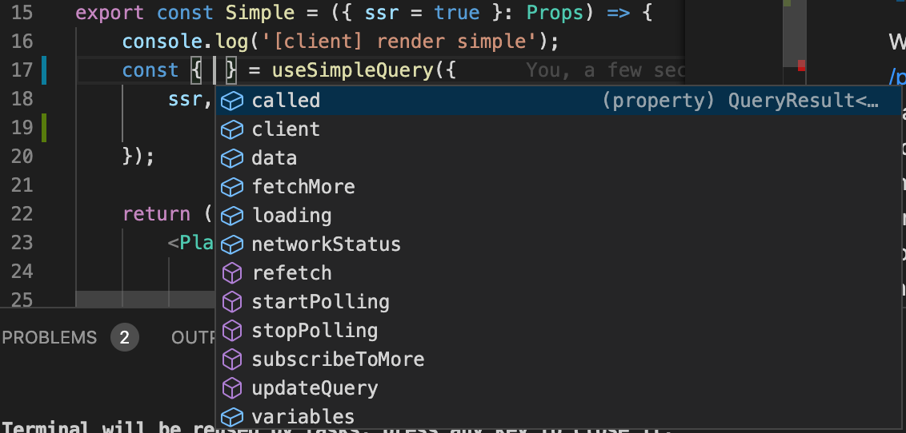
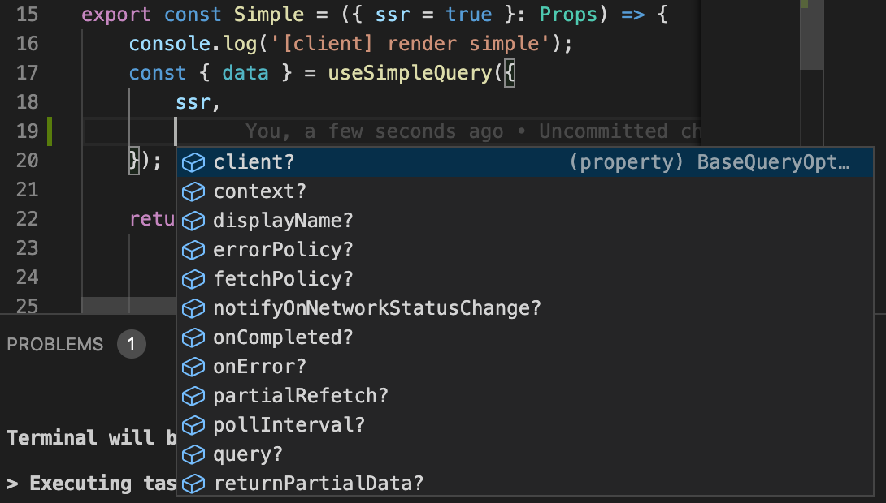
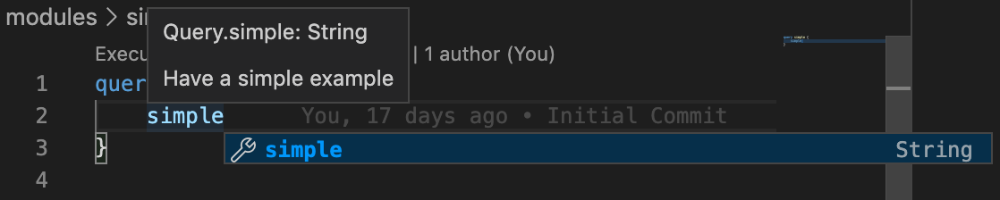
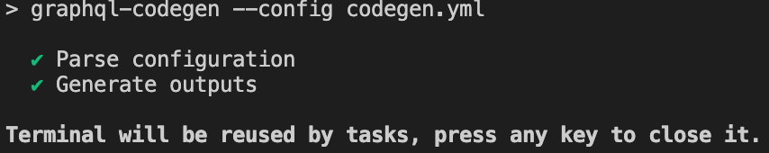
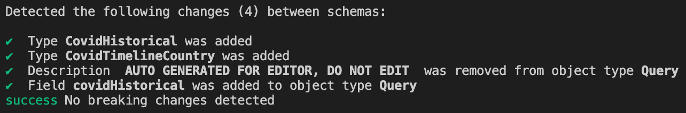
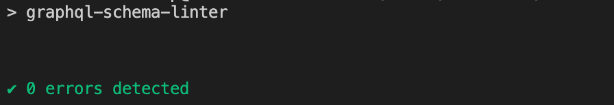
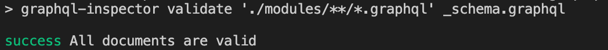
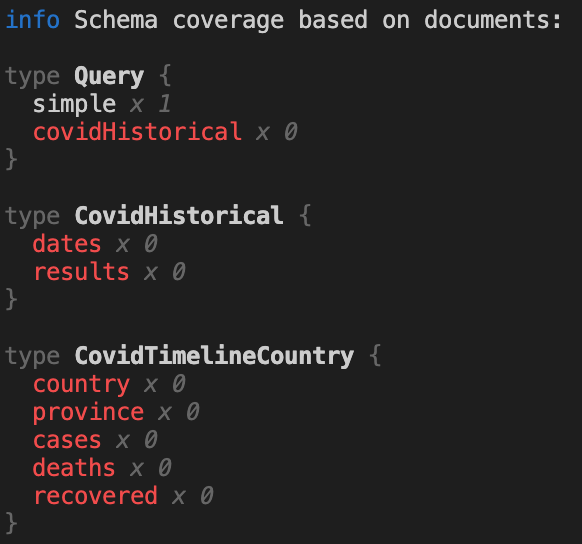

# Setup

> Welcome at this setup for quick starting with GraphQL. Overhere you will find some information about the setup you are now using, by simply running `yarn dev`

## Server

We have the server in this location [/pages/api/graphql](/pages/api/graphql). In the main file you find the basic configuration of the graphql server where you can set things like context, run in mocked mode etc.
You will also find the schema (interfaces) and resolvers (services). In these three different files you can do everything you have to do for our workshop. Our own team is using graphql-modules but since its moving to V1 we keep the workshop as simple as possible so everyone can enter.

## Client

We have our frontend application in these locations [/pages/index](/pages/index.tsx) (page) and [/modules](/modules) (modules/features). For the client we use [Apollo](/lib/apollo.tsx), see 'createApolloClient' for its configuration.

When creating a feature be sure to have a '\*.graphql' file where you defined what you need (query/mutation). When you added that need the [autogen](####-Codegen) will create react hooks for you automatically. So you can start with your component.
Be sure to pace the component on the page, to actually see it :)

So from the '\*.graphql' file in Simple component it generates:

```js
import { useSimpleQuery } from '../../codegen/_graphql';
```

and this query returns data, error loading etc. Also you will be able to add variables to the Query.

So from your editor you will see all options it returns:



and the options you can provide:



## Editor plugin

[vscode prisma graphql plugin](https://marketplace.visualstudio.com/items?itemName=Prisma.vscode-graphql) gives autocomplete on queries and shows the documentation inline. You dont need to go to the playground. All GraphQL usage can be done from the editor!

available queries, with documentation:



autotyping on data need:


## Tooling

We use some tooling provided by [The Guild](https://medium.com/the-guild)

### NPM SCRIPTS

#### Codegen

> For auto generating we are using [graphql-code-generator](https://graphql-code-generator.com/)

During development this runs in autowatch mode.

`yarn codegen`



This auto generates all our TypeScript types: used documents, interfaces, (lazy)hooks and resolvers.

These can be used on the server:

```js
import { Resolvers } from '../../../codegen/_graphql';

export const resolvers: Resolvers = {
    Query: {
        simple: () => {
            console.log('[server] GraphQL server query: simple');
            return 'Welcome to the AH GraphQL workshop';
        },
    },
};
```

But certainly in the client:

```js
import { useSimpleQuery } from '../../codegen/_graphql';

export const Simple = () => {
    const { data } = useSimpleQuery({
        ssr,
    });

    return (
        <Plain>
            <p>{data?.simple}</p>
        </Plain>
    );
};
```

In the client it then gives autotyping of all data you requested. You heave your feature and your query/mutation in the same place.

#### Schema validator

> For schema utilities we are using [graphql-inspector](https://graphql-inspector.com/). We also use this centralised in Github as action. Besides your editor giving feedback you can also run these npm commands:

`yarn schema:diff`: it detects breaking changes in the schema



`yarn schema:linter`: are you changes according to the basic rules?



`yarn schema:validation`: is schema usage valid?



`yarn schema:coverage`: what of the total schema is your application using


